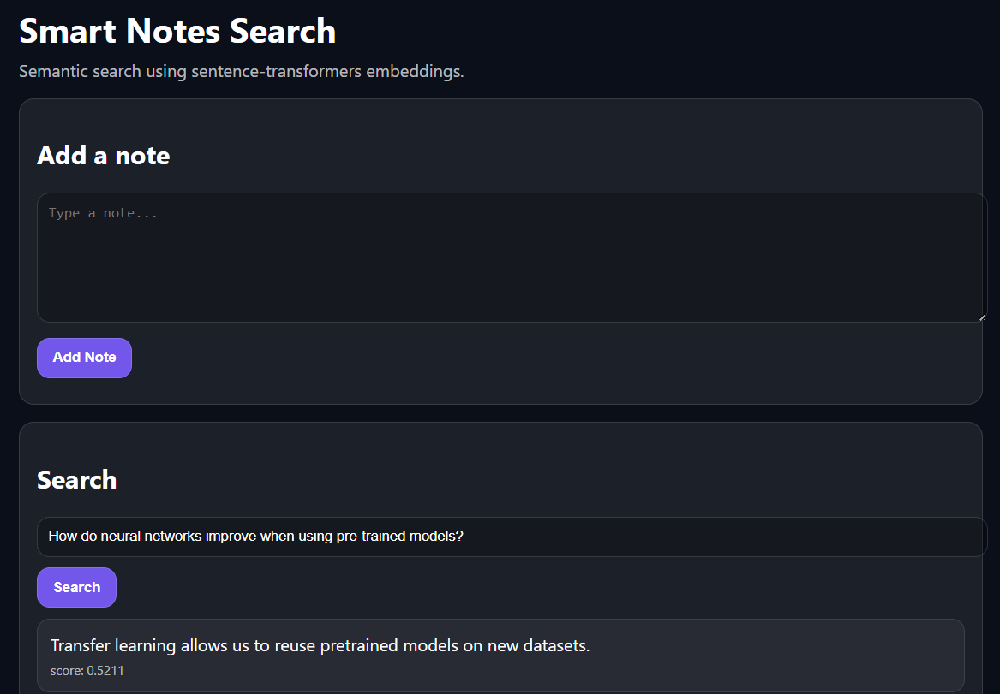
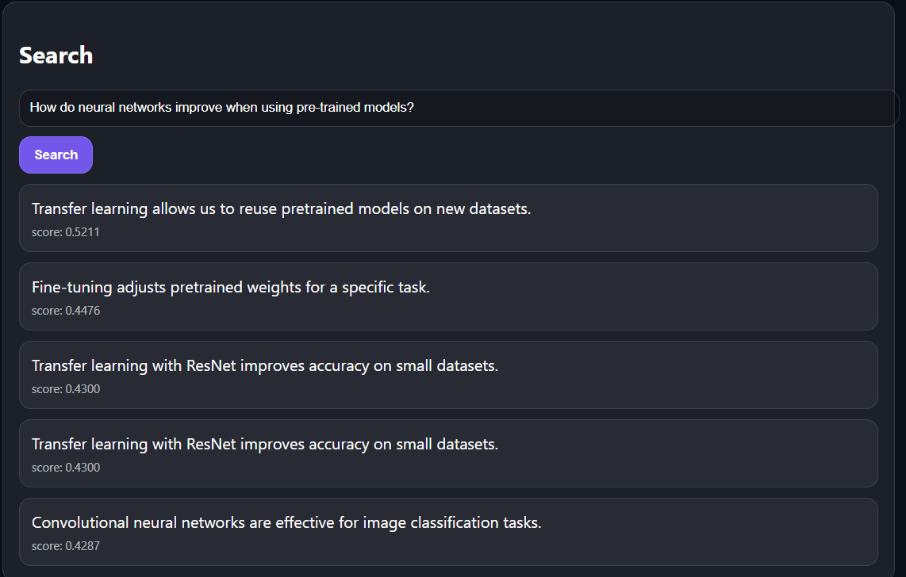

# 🔎 Semantic Search with Hugging Face Transformers

A semantic search web application that uses a fine-tuned Sentence Transformer model to retrieve notes based on meaning instead of exact keyword matching.

---

## 🚀 Project Overview

This project demonstrates:

- Transformer-based sentence embeddings
- Fine-tuning a Hugging Face model on custom similarity pairs
- FastAPI backend for serving embeddings and search
- Optional FAISS vector index for fast similarity search
- Simple frontend interface for adding and searching notes

Instead of traditional keyword search, this system performs **semantic similarity search** using cosine similarity between embeddings.

---

## 🧠 How It Works

1. Notes are converted into dense vector embeddings.
2. User query is also converted into an embedding.
3. Cosine similarity is computed between query and note vectors.
4. Top-k most similar notes are returned.

If FAISS is enabled, similarity search is accelerated using a vector index.

---

<h2>📸 Demo Screenshots</h2>
<p>
  
  
</p>

---

---

## 📚 What I Learned

Building this project helped me understand:

- How transformer-based sentence embeddings work
- The difference between keyword search and semantic search
- How cosine similarity compares embedding vectors
- How to fine-tune a Sentence Transformer using custom similarity pairs
- How to serve ML models using FastAPI
- How to cache embeddings and rebuild vector indexes
- How FAISS accelerates similarity search for larger datasets
- How to structure and deploy a full-stack ML application
- How to manage dependencies and version control with Git and GitHub

---

## ⚠️ Challenges Faced

- Managing large model files in GitHub
- Handling virtual environments correctly
- Understanding embedding normalization
- Ensuring embeddings are rebuilt after model fine-tuning
- Debugging path and environment issues

---

## 🚀 Future Improvements

- Add negative training pairs for better fine-tuning
- Implement confidence thresholding
- Deploy the app publicly
- Add user authentication and persistent storage
- Push finetuned model to Hugging Face Hub

---

## 🛠 Tech Stack

- Python 3.11
- Hugging Face `sentence-transformers`
- FastAPI
- FAISS (optional)
- NumPy
- Uvicorn

---

## ⚙️ Setup Instructions (Windows)

```powershell
cd hf_semantic_search
py -3.11 -m venv .venv
.\.venv\Scripts\Activate.ps1
pip install -r backend/requirements.txt
cd backend
uvicorn app:app --reload --port 8000

